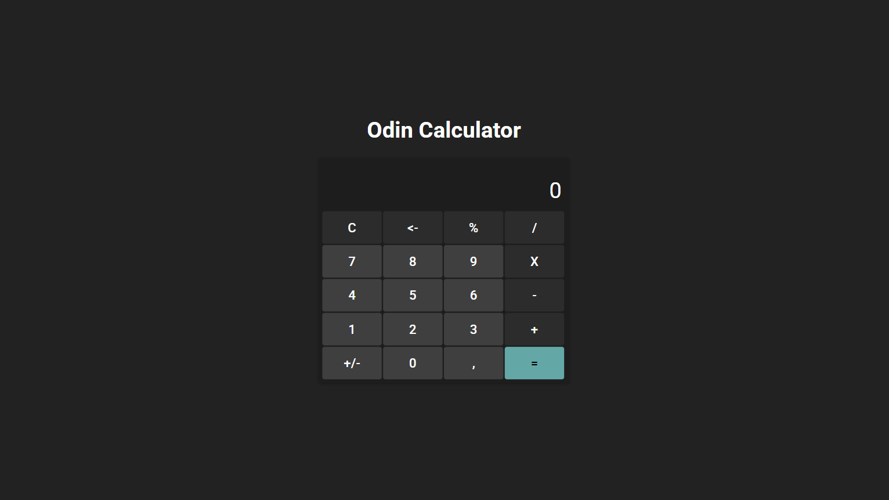
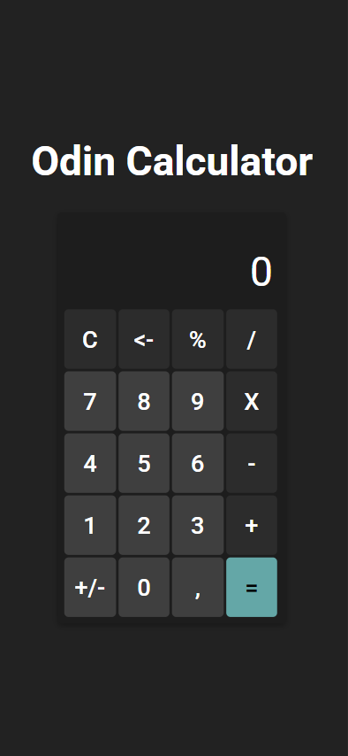

# Odin Calculator

This project is the calculator implementation from the Odin Project's Foundations course.

[**Live Demo**](https://szidelo.github.io/odin-calculator/)

## Overview

The **Odin Calculator** is a functional web-based calculator capable of performing basic arithmetic operations, percentage calculations, and sign toggles. The project emphasizes JavaScript DOM manipulation and CSS styling principles taught in the Odin Project Foundations course.

---

## Features

-   **Basic Arithmetic:** Addition, subtraction, multiplication, and division.
-   **Chaining Operations:** Seamlessly continue calculations by reusing results.
-   **Sign Toggle:** Switch numbers between positive and negative.
-   **Percentage Calculation:** Calculate percentages and relative percentages.
-   **Input Management:**
    -   Delete the last entered digit.
    -   Clear all inputs with a single button.
    -   Prevent invalid or unnecessary inputs like multiple decimal points.
-   **Responsive Design:** Works across various screen sizes, from desktop to mobile.

---

## Built With

-   **HTML5**: Structure of the app.
-   **CSS3**: Styling and layout.
-   **JavaScript (ES6)**: Logic and interactivity.

---

## Installation

To view or edit the project locally:

1. Clone the repository:

    ```bash
    git clone https://github.com/szidelo/odin-calculator.git
    ```

2. Navigate to the project folder:

    ```bash
    cd odin-calculator
    ```

3. Open `index.html` in your preferred browser.

---

## Usage

### **Performing Calculations**

1. **Input Numbers:**
    - Click on the numeric buttons to input the first number.
    - Press an operator button (e.g., `+`, `-`, `*`, `/`).
    - Enter the second number.
2. **View Results:**
    - Press `=` to view the result.

### **Advanced Features:**

-   Use `%` for percentage calculations.
-   Use `+/-` to toggle the sign of the current number.
-   Use `C` to reset the calculator.
-   Use `<-` to delete the last digit.

---

## Screenshots

### Desktop View



### Mobile View



---

## Challenges & Lessons Learned

-   **DOM Manipulation:** Mastered the use of event listeners and DOM updates to reflect changes in user inputs and results.
-   **Error Handling:** Implemented validation to prevent invalid operations such as division by zero.
-   **Responsive Design:** Ensured the calculator is usable across various screen sizes.

---

## Future Improvements

-   **Scientific Calculator Features:** Add functionalities like square roots, trigonometric functions, and memory recall.
-   **Keyboard Support:** Enable keyboard input for faster calculations.
-   **Theme Options:** Provide light and dark themes for better usability.

---

## Acknowledgments

This project is part of the [Odin Project's Foundations Course](https://www.theodinproject.com/paths/foundations/courses/foundations).

---

## License

This project is open-source and available under the MIT License.

---

## Author

**Szidelo**

-   GitHub: [@szidelo](https://github.com/szidelo)
-   Demo: [Live Calculator](https://szidelo.github.io/odin-calculator/)
